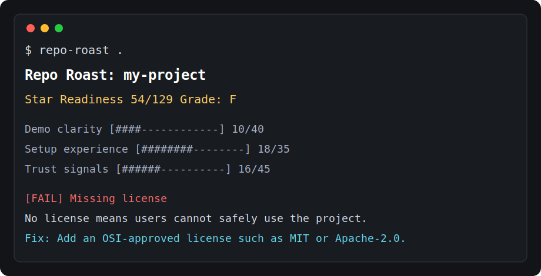

# Repo Roast

Find out why people are not starring, installing, or contributing to your repo.

Repo Roast is a tiny CLI that audits a local repository for **star readiness**: demo clarity, setup experience, trust signals, and contributor friendliness. It is not trying to be another generic security scanner. It looks at the first things humans judge before they decide whether your project is worth their time.



```bash
npx repo-roast-cli .
```

```txt
Repo Roast: my-project
Star Readiness 54/129  Grade: F

Scoreboard
  Demo clarity               [####------------] 10/40
  Setup experience           [########--------] 18/35
  Trust signals              [######----------] 16/45
  Contributor friendliness   [#######---------] 11/25

Roasts
  [FAIL] Missing license (0/15)
     No license means users cannot safely use the project. That is a star repellent.
     Fix: Add an OSI-approved license such as MIT or Apache-2.0.
```

## Why

Most repository scanners answer: “Is this project technically healthy?”

Repo Roast asks a more painful question:

> Would a stranger understand, trust, try, and star this repo in under one minute?

## Checks

- README presence and usefulness
- Visual demo or screenshot
- Copy-paste quickstart command
- Install/setup instructions
- Package entry points and scripts
- License
- GitHub Actions
- Security policy
- Contributing guide
- Issue templates
- Code of Conduct
- Environment variable examples
- Obvious hardcoded secret patterns

## Usage

```bash
repo-roast .
repo-roast ../my-library
repo-roast . --json
repo-roast . --no-color
```

## Development

```bash
npm install
npm run build
npm test
npm run roast
```

## Roadmap

- `repo-roast fix` to generate missing launch files
- GitHub URL mode using the GitHub API
- Markdown report export for pull requests
- Custom rules through `repo-roast.config.json`
- Badge generator for README score

## License

MIT
